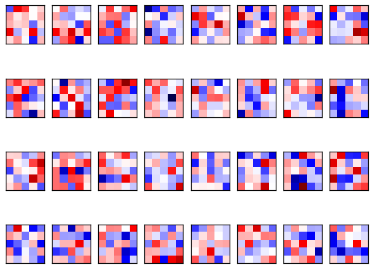
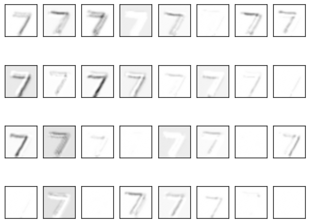
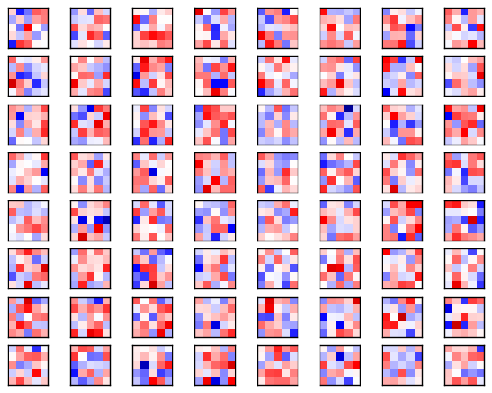
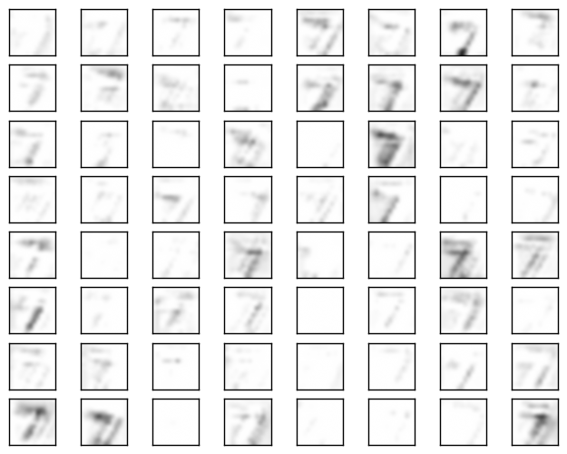

# Conviz

Conviz is an example of visualizing weights and output of convolutional layers. In this project I show how to add
convolution kernels and output of convolutional layers to a collection that fetched and visualized after training is completed. This approach can be easily generalized 
to arbitrary number of layers.

It is based on the following tutorials:
* [3_NeuralNetworks](https://github.com/aymericdamien/TensorFlow-Examples/blob/master/examples/3_NeuralNetworks/convolutional_network.py)
* [02_Convolutional_Neural_Network](https://github.com/Hvass-Labs/TensorFlow-Tutorials/blob/master/02_Convolutional_Neural_Network.ipynb)

MNIST data set that is shiped with Tensorflow is used in this example. 

# Output
Plotted convolution kernels and output of convolutional layers are saved to disk.

# Dependencies
* Numpy
* Matplotlib
* Tensorflow